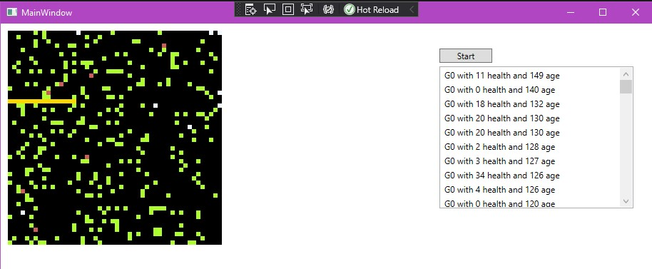

# Efilir

Efilir - это наброски проекта для визуализации "движений" пикселей на поле. Разработан для моделирования выполнения генетического алгоритма.

## Stack

- .NET 5
- WPF

## Планы

Планируется:
- реализовать возможность задавать алгоритм движения объектов через конфигурационные файлы, разработать язык описания этого алгоритма
- расширить функционал взаимодействия объектов с окружением
- добавить генерации статистики объектов, а самим объектам дополнительные характеристики. Если говорить про продолжение темы с генетическим алгоритмом, то это характеристики такое как возраст, а статистика - средняя длинна жизни популяции.

## Механика

Цикл выполнения представляет собой прокручивание цикла выполнения поля. На поле есть несколько ключевых эдементов:
- Живые клетки
- Еда
- Стены

Клетка - это точка на поле. Она имеет координаты и угол поворота, который представлен числом от 0 до 7. Клетка умеет выполнять ряд действий:
- Повернуться на какой-то угол
- Передвинуться в одном из 8 направлений относительно своего поворота.
- Взаимодействовать с клеткой, которая находится рядом.

Алгоритм клетки представляет собой последовательность из 64 команд.
Каждая команда, это значение от 0 до 63:
- [0..7] - сделать движение по направлению с поворотом, которое задается значением. 0 - это по направления, куда смотрит. 1 - это сдвиг на 1 по часовой стрелке относительно направления клетки. После движения выполняется взаимодействие, если в этой ячейке что-то находится. Выполняется сдвиг команда в соответствии с типом ячейки.
- [8..15] - Взаимодействовать с клейткой по направлению с поворотом. Выполняется сдвиг команда в соответствии с типом ячейки.
- [16..23] - Проверка ячейки по направлению с поворотом. Выполняется сдвиг команда в соответствии с типом ячейки.
- [24..31] - Поворот по часовой клетке относительно направления клетки
- [32..63] - сделать шифт по массиву команд на N команд вперед в соответствии со значением.

## Screenshot

